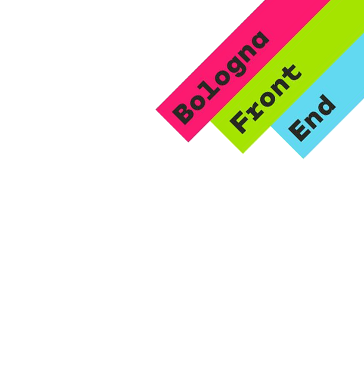

# CLAUDE.md - AI Assistant Guide for Nomade Digitaché Project

## Project Overview

**Project Name:** Nomade digitaché?!? (Digital Nomad What?!?)
**Type:** HTML Presentation (reveal.js-based)
**Author:** Luca Stefano Sartori (@phaberest)
**Language:** Italian
**Purpose:** Conference/meetup presentation about digital nomad lifestyle
**Audience:** Bologna Front End community
**Framework:** reveal.js 3.8.0
**Total Size:** ~137MB (mostly media assets)

This is a customized reveal.js presentation documenting the author's experiences as a digital nomad across Southeast Asia and Europe, combining personal storytelling with technical problem-solving anecdotes.

---

## Critical Context for AI Assistants

### What This Project IS
- A **content-first presentation** with minimal custom code
- A **photo-heavy narrative** (123MB images, 9MB videos)
- A **performance-optimized** reveal.js implementation
- A **personal story** about digital nomad lifestyle told to Italian developers

### What This Project IS NOT
- A web application or service
- A software library or framework
- A documentation site
- A multi-page website

### Key Design Philosophy
1. **Minimal modification approach** - Don't modify reveal.js core
2. **Performance-first** - Lazy load everything, zero transitions
3. **Content over code** - Value is in media and narrative, not custom features
4. **Multi-format delivery** - Optimized for both screen presentation and PDF export

---

## Codebase Structure

```
/home/user/nomade-digitache/
├── index.html              # MAIN PRESENTATION (529 lines) - PRIMARY FILE
├── demo.html               # Standard reveal.js demo (leave untouched)
├── css/
│   ├── custom.scss         # ONLY CUSTOM CSS FILE - modify this for styling
│   ├── reveal.css          # Core reveal.js (don't modify)
│   ├── reset.css           # CSS reset (don't modify)
│   ├── theme/              # Built-in themes (don't modify)
│   └── print/              # Print stylesheets (don't modify)
├── js/
│   └── reveal.js           # Core library (168KB, don't modify)
├── img/                    # 123MB of images (66 files)
│   ├── foto/               # 22 travel photos (55MB)
│   ├── ws1-16.png          # Workspace screenshots
│   ├── bfe.png             # Header logo (Bologna Front End)
│   ├── logo.svg            # Footer logo (Nerd The Travel)
│   └── [infographics, icons, GIFs, screenshots]
├── vids/                   # 5 MP4 videos (9MB)
├── plugin/                 # Standard reveal.js plugins (unmodified)
├── lib/                    # Third-party dependencies (unmodified)
├── gruntfile.js            # Build configuration
├── package.json            # Node dependencies
└── .vscode/                # VSCode settings (Jira plugin)
```

### Files AI Assistants Should Modify
✅ **index.html** - Main presentation content
✅ **css/custom.scss** - Custom styles
✅ **img/** - Add/optimize images
✅ **vids/** - Add/optimize videos
✅ **README.md** - Documentation
✅ **package.json** - Dependencies (with caution)

### Files AI Assistants Should NOT Modify
❌ **js/reveal.js** - Core library
❌ **css/reveal.css** - Core styles
❌ **plugin/** - Standard plugins
❌ **lib/** - Third-party code
❌ **demo.html** - Reference implementation
❌ **css/theme/** - Built-in themes

---

## Development Workflows

### Starting Development Server
```bash
npm install          # Install dependencies (first time only)
npm start            # Starts Grunt server on http://localhost:8000
```

### Build Tasks
```bash
npm run build        # Compile SASS → CSS, minify, uglify
npm test             # Run JSHint + QUnit tests
```

### Viewing the Presentation
- **Development:** http://localhost:8000 (auto-reload on changes)
- **Direct file:** Open index.html in browser (limited functionality)
- **PDF Export:** http://localhost:8000/?print-pdf (then Save as PDF)

### Grunt Tasks (via gruntfile.js)
- `grunt serve` - Start dev server + watch for changes
- `grunt css` - Compile SASS → CSS → Autoprefixer → Minify
- `grunt js` - JSHint → Uglify
- `grunt test` - Run test suite
- `grunt zip` - Package for distribution

---

## Key Conventions & Patterns

### 1. Image/Video Loading Pattern
**CRITICAL:** All media MUST use `data-src` for lazy loading

```html
<!-- ✅ CORRECT - Lazy loaded -->

<video data-src="./vids/example.mp4"></video>
<iframe data-src="https://example.com"></iframe>

<!-- ❌ WRONG - Loads immediately, kills performance -->

```

**Why:** Project has 132MB of media. Lazy loading loads only visible + adjacent slides.

### 2. Presentation Structure Pattern
Each major topic is a vertical stack:

```html
<section>
  <section>
    <h3>Topic Title</h3>
  </section>
  <section>
    <!-- Subtopic 1 content -->
  </section>
  <section>
    <!-- Subtopic 2 content -->
  </section>
</section>
```

**Navigation:** Left/Right = main topics, Up/Down = subtopics

### 3. Custom CSS Classes

```scss
// Remove borders from specific images
.nb {
  border: none !important;
  background-color: transparent !important;
}

// Profile/social links with SVG icons
a.profile-link {
  display: flex;
  align-items: center;
  gap: 10px;
}

// Clothing inventory display
.side-icon {
  width: 100px;
  position: relative;
}

// Layout utilities
.w25 { min-width: 25%; }
```

### 4. Reveal.js Configuration
**Location:** End of index.html in `<script>` tag

```javascript
Reveal.initialize({
  width: 1920,                    // Full HD
  height: 1080,
  margin: 0,                      // No margins
  minScale: 1,                    // No scaling
  pdfMaxPagesPerSlide: 1,         // PDF optimization
  pdfSeparateFragments: false,    // All fragments on one page
  hash: true,                     // URL hash navigation
  history: true,                  // Browser history
  transition: 'none',             // No transitions
  progress: false,                // No progress bar
  dependencies: []                // No plugins loaded
});
```

**Performance Choice:** Zero plugin dependencies for faster load.

### 5. Header/Footer Pattern
Persistent branding across all slides:

```html
<!-- Header (top-right) -->


<!-- Footer (bottom-left) -->
<footer id="footer"
        style="z-index: 4; position: absolute; bottom:1rem; left:1rem;
               display:flex; align-items: center; gap: 1rem;">
  
  <a href="https://instagr.am/nerdthetravel">@nerdthetravel</a>
</footer>
```

**PDF Export:** Custom JavaScript clones header/footer on every PDF page.

### 6. Semantic Alt Text
All images MUST have descriptive alt text (SEO + accessibility):

```html
✅ 
❌ 
```

---

## Technical Details

### Technology Stack
- **Framework:** reveal.js 3.8.0
- **CSS Preprocessor:** SASS (node-sass 4.11.0)
- **Build Tool:** Grunt 1.0.4
- **Dev Server:** Express 4.16.2
- **Node Version:** 9.0.0+
- **Testing:** QUnit + JSHint

### Dependencies (package.json)
Build-only dependencies (not runtime):
- grunt-sass, grunt-autoprefixer, grunt-contrib-cssmin
- grunt-contrib-uglify, grunt-contrib-watch
- grunt-contrib-connect, grunt-zip
- socket.io (for multiplex plugin)

### Browser Compatibility
- Modern browsers (Chrome, Firefox, Safari, Edge)
- Legacy support via html5shiv.js (IE9+)
- Mobile-friendly (touch navigation enabled by default)

### Performance Optimizations
1. **Lazy Loading:** All 100+ images/videos use `data-src`
2. **No Transitions:** `transition: 'none'` for instant navigation
3. **No Plugins:** Zero plugin dependencies loaded
4. **Optimized Assets:** JPEG compression for photos
5. **Minimal Scale:** No responsive scaling (1:1 display)

### PDF Export
1. Navigate to: http://localhost:8000/?print-pdf
2. Open Print dialog (Ctrl/Cmd+P)
3. Settings:
   - Destination: Save as PDF
   - Layout: Landscape
   - Margins: None
   - Background graphics: Enabled
4. Save

**Custom Feature:** JavaScript automatically clones header/footer on every PDF page.

---

## Content Structure

### Main Presentation Sections (index.html)

1. **Title Slide:** "Nomade digitaché?!?"
2. **Introduction:** Who is Luca (GitHub, Stack Overflow, Twitter, LinkedIn profiles)
3. **Concept:** "Freelance on cloud" metaphor
4. **Statistics:** Remote work vs digital nomading data
5. **Challenges:** Loneliness, disconnection, work-life balance
6. **Benefits:** Travel, health, perspective, meeting people
7. **Philosophy:** Stefan Sagmeister TED talk, Seth Godin quote
8. **Packing:** Minimalist clothing (5kg) vs tech gear (20kg)
9. **Workspaces:** 16 different "offices" across 11 cities
10. **Problem-Solving:** Battery replacement, WiFi workarounds, power solutions
11. **Joy:** Photo galleries from Thailand, Vietnam, Cambodia, Malaysia, Portugal
12. **Closing:** "That's all folks (to be continued...)"

### Key Messages
- Digital nomading ≠ Remote work (most remotes still work from home)
- It's about lifestyle, not vacation
- Technical challenges require creative solutions
- Minimalism in possessions, richness in experiences
- Work-life integration over work-life balance

### Social Media Integration
- **Personal:** @phaberest (GitHub, Stack Overflow, Twitter)
- **Travel Blog:** @nerdthetravel (Instagram)
- **Professional:** Luca Stefano Sartori (LinkedIn)

---

## Guidelines for AI Assistants

### When Adding Content

1. **Follow the vertical stack pattern:**
   ```html
   <section>
     <section><h3>Topic</h3></section>
     <section><!-- content --></section>
   </section>
   ```

2. **Always use lazy loading:**
   ```html
   
   ```

3. **Optimize images before adding:**
   - JPG for photos (quality 80-85%)
   - PNG for screenshots/graphics
   - GIF for animations (keep small <2MB)
   - SVG for logos/icons

4. **Maintain Italian language** (unless explicitly asked to translate)

5. **Keep consistent branding:**
   - Header: Bologna Front End logo (top-right)
   - Footer: Nerd The Travel logo + Instagram (bottom-left)

### When Modifying Styles

1. **Edit only css/custom.scss** (never css/reveal.css)
2. **Compile after changes:** Run `npm run build`
3. **Test in browser:** Check http://localhost:8000
4. **Verify PDF export:** Check http://localhost:8000/?print-pdf

### When Optimizing Performance

1. **Check image sizes:** Run `du -sh img/*` to find large files
2. **Compress images:** Use tools like `imageoptim` or `jpegoptim`
3. **Convert to data-src:** Ensure all `src` attributes use `data-src`
4. **Test load time:** Monitor network tab in browser DevTools

### When Debugging

1. **Check browser console:** Open DevTools → Console
2. **Verify file paths:** All paths relative to index.html
3. **Test media loading:** Images should load when slide becomes visible
4. **Check grunt output:** Look for SASS compilation errors

### Common Tasks

#### Add a new slide
```html
<section>
  <h3>New Topic</h3>
  <p>Content here</p>
  
</section>
```

#### Add a new image
1. Save image to `img/` directory
2. Reference with `data-src="./img/filename.jpg"`
3. Add descriptive `alt` text
4. Optimize file size (<5MB preferred)

#### Add a video
1. Save MP4 to `vids/` directory
2. Use HTML5 video tag with `data-src`
3. Add fallback message for unsupported browsers
```html
<video data-src="./vids/example.mp4" controls>
  Your browser doesn't support HTML5 video.
</video>
```

#### Add external embed (YouTube, TED, etc.)
```html
<iframe data-src="https://embed.ted.com/talks/..."
        width="854" height="480" frameborder="0" allowfullscreen>
</iframe>
<!-- Add fallback link below -->
<p><a href="https://ted.com/talks/...">View on TED.com</a></p>
```

#### Modify styling
1. Open `css/custom.scss`
2. Add/modify SCSS rules
3. Run `npm run build`
4. Refresh browser (or use auto-reload)

#### Test PDF export
1. Start dev server: `npm start`
2. Navigate to: http://localhost:8000/?print-pdf
3. Wait for all slides to render
4. Print to PDF with correct settings
5. Verify header/footer on all pages

---

## Project History & Evolution

### Recent Commits (Reverse Chronological)
- **2019-07-07:** Optimized TED embed for faster loading
- **2019-06-28:** SEO fixes (alt text, semantic improvements)
- **2019-06-27:** Fixed header/footer images in PDF export
- **2019-06-27:** Implemented lazy loading for all media
- **2019-06-25:** Content completion (bis)
- **2019-06-25:** Content completion
- **2019-06-24:** PDF optimization - all fragments on single page
- **2019-04-06:** Removed missing modules from gruntfile

### Development Pattern
The project shows iterative refinement:
1. Initial content development (April-June 2019)
2. Performance optimization phase (late June 2019)
3. PDF export polishing (late June-early July 2019)
4. Final SEO/accessibility improvements (June-July 2019)

### Maintenance Philosophy
- **Minimal dependencies:** Avoid adding npm packages unless essential
- **Standard reveal.js:** Don't fork or modify core framework
- **Content-focused:** Changes should improve narrative or performance
- **Production-ready:** Every commit should be presentation-ready

---

## Common Issues & Solutions

### Issue: Images not loading
**Cause:** Using `src` instead of `data-src`
**Solution:** Change all `src` to `data-src` for lazy loading

### Issue: Styles not updating
**Cause:** SCSS not compiled to CSS
**Solution:** Run `npm run build` or use `npm start` for auto-compile

### Issue: PDF export looks wrong
**Cause:** Print stylesheet not loaded or wrong URL parameter
**Solution:** Use `?print-pdf` query parameter, not `?print`

### Issue: Videos not playing
**Cause:** Browser autoplay restrictions
**Solution:** Add `controls` attribute, don't rely on autoplay

### Issue: Slow performance
**Cause:** Too many high-res images loading at once
**Solution:**
1. Verify all images use `data-src`
2. Compress image files
3. Use `viewDistance` configuration to limit preloading

### Issue: Broken header/footer in PDF
**Cause:** Custom cloning script not running
**Solution:** Check JavaScript at end of index.html for PDF clone logic

---

## Best Practices

### DO ✅
- Use `data-src` for all media (images, videos, iframes)
- Add descriptive alt text to all images
- Compress images before adding (target <5MB per image)
- Test both screen and PDF export after changes
- Keep Italian language consistent
- Follow existing code formatting
- Commit with descriptive messages
- Run `npm run build` before committing CSS changes

### DON'T ❌
- Modify reveal.js core files (js/reveal.js, css/reveal.css)
- Add plugin dependencies without strong justification
- Use `src` attribute for media (breaks lazy loading)
- Commit uncompiled SCSS changes (always build first)
- Add huge images (>10MB) without compression
- Change presentation aspect ratio (1920x1080)
- Add transitions or animations (conflicts with performance goals)
- Remove header/footer branding

---

## Testing Checklist

Before considering work complete:

- [ ] Presentation loads without console errors
- [ ] All images display correctly
- [ ] Videos play when expected
- [ ] Navigation works (arrow keys, touch swipes)
- [ ] Header/footer visible on all slides
- [ ] PDF export renders correctly
- [ ] No broken links
- [ ] Alt text on all images
- [ ] Italian language maintained
- [ ] File sizes reasonable (<150MB total)
- [ ] `npm run build` succeeds without errors
- [ ] `npm test` passes (if applicable)

---

## Resources & References

### Official Documentation
- [reveal.js Documentation](https://revealjs.com/)
- [reveal.js GitHub](https://github.com/hakimel/reveal.js)
- [Grunt Documentation](https://gruntjs.com/)
- [SASS Documentation](https://sass-lang.com/)

### Project-Specific Links
- **Author Portfolio:** [GitHub @phaberest](https://github.com/phaberest)
- **Travel Blog:** [Instagram @nerdthetravel](https://instagr.am/nerdthetravel)
- **Professional:** [LinkedIn - Luca Stefano Sartori](https://www.linkedin.com/in/lucasartori/)

### External References (cited in presentation)
- [State of Remote Work 2018 Report](https://open.buffer.com/state-remote-work-2018/)
- [Remote Working Lessons](https://blog.quuu.co/lessons-worth-learning-from-remote-workers/)
- [Stefan Sagmeister TED Talk](https://www.ted.com/talks/stefan_sagmeister_the_power_of_time_off)
- Seth Godin Quote: "Get a life you don't need a vacation from"

---

## Quick Reference

### File Sizes
- **Total:** ~137MB
- **Images:** 123MB (66 files)
- **Videos:** 9MB (5 files)
- **Code:** ~5MB (reveal.js + dependencies)

### Key Files
- **Main presentation:** index.html (529 lines)
- **Custom styles:** css/custom.scss (~100 lines)
- **Build config:** gruntfile.js
- **Dependencies:** package.json

### Ports & URLs
- **Dev server:** http://localhost:8000
- **PDF export:** http://localhost:8000/?print-pdf
- **Custom port:** `npm start -- --port=8001`

### Commands
```bash
npm install          # Install dependencies
npm start            # Start dev server
npm run build        # Build CSS/JS
npm test             # Run tests
grunt serve          # Alternative to npm start
grunt css            # Build CSS only
grunt js             # Build JS only
```

---

## Contact & Support

**Author:** Luca Stefano Sartori
**Email:** luca@codersmedia.it
**GitHub:** [@phaberest](https://github.com/phaberest)
**Stack Overflow:** [phaberest](https://stackoverflow.com/users/phaberest)
**Twitter:** [@phaberest](https://twitter.com/phaberest)
**LinkedIn:** [Luca Stefano Sartori](https://www.linkedin.com/in/lucasartori/)

---

## License

MIT License (inherited from reveal.js)

Copyright (C) 2019 Hakim El Hattab (reveal.js)
Copyright (C) 2019 Luca Stefano Sartori (presentation content)

---

## Version History

**Last Updated:** 2025-11-13
**Document Version:** 1.0.0
**Project Version:** Based on reveal.js 3.8.0
**Last Commit:** 9d724e0 - "Optimized TED embed for faster loading"

---

*This CLAUDE.md file was generated to help AI assistants understand and work effectively with this codebase. When in doubt, prioritize content quality, performance, and the existing design philosophy of minimal modification to the reveal.js framework.*
